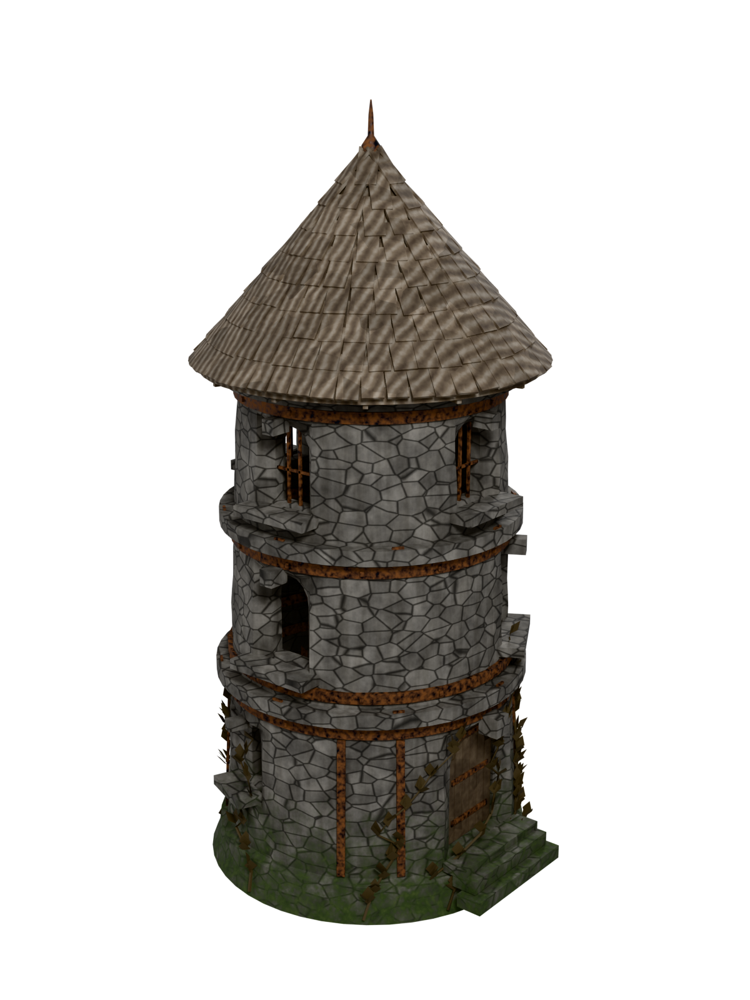
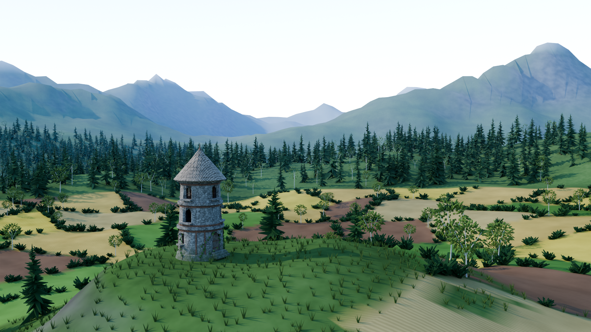

# Nordic Stone Watchtower

A weathered three-story Nordic stone watchtower, generated procedurally in
Blender by a single script. Everything — geometry, UVs, materials, lighting and
the turntable-style hero render — is produced from `watchtower.py`; no `.blend`
needs to be edited by hand.



A second script, `environment.py`, drops the same tower into a procedural
Nordic landscape — farmland, forest and mountains. See
[Landscape environment](#landscape-environment) below.



## Running it

The script works both against a Blender install and against the `bpy` Python
module:

```bash
pip install bpy          # only needed for the module route
python3 watchtower.py

# or, with a normal Blender install
blender --background --python watchtower.py
```

Flags:

| Flag | Effect |
| --- | --- |
| `--preview` | Fast 600×800 / 24-sample render, and 512² instead of 1024² bakes |
| `--no-render` | Build, bake and export only — skip rendering entirely |
| `--no-bake` | Skip the texture bake (exports untextured; useful for quick geometry iteration) |

## Outputs

| Path | Contents |
| --- | --- |
| `assets/watchtower.blend` | Editable source: four meshes, six procedural materials, camera and studio lights |
| `assets/watchtower.glb` | Game-engine-ready glTF binary, Y-up, with baked PBR textures embedded |
| `assets/textures/*.png` | The baked maps written out loose for inspection (base colour, ORM, normal per object). Not tracked in git — they are already embedded in the GLB |
| `renders/watchtower_preview.png` | Hero render, RGBA with a transparent background |

## The model

Roughly 15.4 Blender units tall on a 6.8-unit circular base, split into four
objects so the material assignment stays simple:

| Object | Quads | Contents |
| --- | ---: | --- |
| `Watchtower_Stone` | 3116 | Battered wall, plinth, string courses, window reveals, sills, keystones, doorstep |
| `Watchtower_Wood` | 2076 | Shingle roof, fascia, soffit, eave brackets, plank door |
| `Watchtower_Iron` | 1666 | Reinforcement bands, anchor plates, wall straps, window bars, hinge straps, finial |
| `Watchtower_Ivy` | 817 | Vine stems and leaf cards on the lower walls |

**7675 faces, all quads — no triangles and no n-gons anywhere.** The script
prints a per-object face breakdown on every run, so a regression in topology
shows up immediately.

Every mesh is UV-unwrapped with a smart projection, and the stone and iron use
angle-based smooth shading while the wood stays flat-shaded so individual
shingles keep their crisp edges.

### Arched openings

The openings are genuinely cut through the wall rather than faked with dark
decals. For each opening the builder:

1. Removes a rectangular block of cells from the wall's ring/segment grid, with
   every opening boundary height forced onto an exact ring so the hole lands on
   grid lines.
2. Bridges that rectangular boundary loop to an arch outline resampled by arc
   length to the *same* vertex count — corner-anchored side by side, so the
   resulting splayed stone reveal is entirely quads.
3. Extrudes the arch loop inward for the reveal tunnel and caps the back with a
   near-black material, so the opening reads as depth from any angle.

Openings are declared in the `RAW_OPENINGS` table near the top of the file
(azimuth, sill height, width, springing height, surround thickness, kind).
Azimuths get snapped to the wall grid automatically, so new windows can be added
by appending a row. The three stories carry arrow slits, plain arched windows
and iron-barred windows respectively, plus an arched plank door on a raised
step — a defensive tower's door sits above ground level.

### Materials

Six procedural PBR materials, all driven by object coordinates so they need no
texture files:

- **Stone** — coursed rubble masonry built from a Voronoi *distance-to-edge*
  pass for the recessed joints, with the coordinates squashed vertically so the
  blocks read as courses. Because it is 3D noise there is no seam where the
  texture wraps around the cylinder. Layered on top: per-block tone variation,
  vertical rain staining from Z-stretched noise, and moss keyed to a height mask
  so it fades out above the first story.
- **Wood** — wave grain broken up by noise, plus a Voronoi layer scaled to a
  single shingle so neighbouring shingles differ in tone.
- **Iron** — dark metal with rust patches that drive base colour, roughness and
  metallic together, so rusted areas correctly stop behaving like bare metal.
- **Ivy**, **ivy stem**, and a near-black **recess** material for opening
  interiors.

### Texture baking

glTF has no way to represent a procedural node graph, so exporting the
procedural materials directly produces a model whose every surface is flat
white — visually nothing like the render. The script therefore bakes before it
exports.

Each channel is captured by temporarily rerouting the relevant Principled BSDF
input through an Emission shader and doing an `EMIT` bake. That reads the shader
value directly with no light transport, so it is exact and needs only one
sample; normals use Blender's `NORMAL` bake to get a tangent-space map out of
the procedural bump. Roughness and metallic are then packed into the green and
blue channels of a single ORM image — the layout glTF expects — and wired
through a Separate Color node, which keeps the exporter from improvising its own
channel packing.

The baked image materials are swapped in only for the duration of the export and
the procedural ones are restored afterwards, so `watchtower.blend` remains the
editable source while `watchtower.glb` carries self-contained textures. Because
the bake is what makes the two agree, changing a material means re-running the
script rather than editing the GLB.

### Lighting and framing

A neutral three-point area-light rig over a soft grey world, with film
transparency on and no ground plane. Light intensity is scaled by the square of
the rig's distance, so the exposure holds if the model's size changes.

The camera fit is computed rather than hand-placed: bounding-box corners are
projected onto the camera's own right/up axes, the aim point is set to the
centre of those projected extents, and the distance is solved so every corner
lands inside the frame. A bounding *sphere* would waste most of the frame on a
model this tall and narrow.

Colour management uses Blender's **Khronos PBR Neutral** view transform instead
of the AgX default. AgX lifts and desaturates an isolated asset until the stone
reads as white plaster; the Khronos transform preserves albedo, which is what
you want when the render is meant to represent the asset itself.

## Landscape environment

`environment.py` places the tower in context. It imports `watchtower.py` and
calls `build_watchtower()`, so the tower in the landscape is the same model —
change the tower and the landscape shot follows automatically.

```bash
python3 environment.py            # 1920x1080
python3 environment.py --preview  # fast 960x540 check
python3 environment.py --no-render
```

Outputs `assets/environment.blend` and `renders/environment.png`. The scene
file is not tracked in git — it is ~11 MB of instanced forest geometry that
rewrites wholesale on every tweak, and `--no-render` rebuilds it in about a
minute. It is saved compressed (28.1 MB uncompressed vs 10.9 MB compressed).

### Terrain

The ground is a **radial** grid rather than a square one: 384 spokes, with
uniform fine rings across the farmland belt and geometric growth beyond it out
to 2.6 km — 130 rings and about 50,000 faces in total. Detail lands where the
camera is while the distant mountains cost almost nothing; a uniform grid fine
enough for the foreground would need many times the faces to reach as far. It is
all quads apart from a small triangle fan closing the very centre, which sits
under the tower's footprint and is never visible.

Height is three layers: a rolling farmland basin, forested foothills, and a
ridged-noise mountain range. The peak height and distance are tuned together so
the range reads on the skyline without overshooting the top of frame. A level
pad is blended in under the tower so it does not sit on a slope.

### Farmland, forest and the rule they share

A single predicate decides what ground can be ploughed — low enough, level
enough, and inside a belt around the tower. `is_field()` implements it, and the
tree scatter obeys it, so fields and forest never contend for the same ground:
trees settle on slopes too steep to plough and out past the farmland belt.

The field partition itself is computed **in Python**, not as a shader Voronoi.
Seeds sit on a jittered grid, and for any point the two nearest seeds give both
the crop and the distance to the boundary between them. Crop colour and that
boundary distance are painted onto the terrain as vertex colour attributes which
the material reads. This is what lets hedgerow bushes stand exactly on the
boundaries the material draws — a shader Voronoi is crisper, but the scatter
could never find its edges. The fine inner rings exist to keep those painted
boundaries from blurring.

Hedges go on only about half the boundaries, chosen by hashing the pair of
fields that meet there. That decision is stable along a boundary's whole length,
so hedges form continuous lines; scattering on *every* boundary reads as random
dots rather than field margins.

### Vegetation

Trees are built from dozens of tapered four-sided spurs rather than a smooth
cone — a cone reads as a low-poly toy no matter how finely it is subdivided,
while the spurs give a broken, bushy silhouette. Spruce spurs angle up near the
crown and droop toward the ground; birch carries a canopy of leaf clumps on a
few rising limbs.

That detail is affordable because trees are **real instances**: objects sharing
one mesh datablock, which Cycles stores once no matter how many stand in the
forest. Around 6,800 trees plus bushes, grass tufts and boulders evaluate to
roughly 3.4 million faces from about 7,400 unique ones.

Templates come in two levels of detail, picked per tree by distance to the
camera so the budget goes where it is resolvable. The level has to come from the
camera distance and nothing else — an earlier version handed hedgerow trees the
reduced template unconditionally, and a coarse one landing in the foreground was
immediately obvious.

### Lighting

Two findings drove the look, both verified by test render rather than guessed:

- **Ground specular had to go.** Left at the Principled default, grazing-angle
  Fresnel mirrors the bright sky across the whole terrain and washes the
  landscape out to pastel. A controlled probe put the foreground at
  `(0.58, 0.68, 0.63)` with default specular versus `(0.39, 0.58, 0.36)` with it
  disabled. Soil, crops and grass are effectively pure diffuse, so the terrain
  and foliage set Specular IOR Level to 0.
- **The sky is split by ray type.** A full-strength physical sky floods the
  scene with ambient fill and flattens the sun's shadows away. A Light Path node
  shows the bright sky to camera rays while lighting the landscape at 0.42
  strength, so the sun still carries the shading.

Distance haze is faked by mixing surface colour toward the sky tone using camera
depth. Real atmospheric volumetrics would dominate render time at this scale for
a stills-only benefit.

Unlike the isolated asset, this scene renders through **AgX** — a landscape
spans a far wider dynamic range, and Khronos PBR Neutral flattens the sky.
