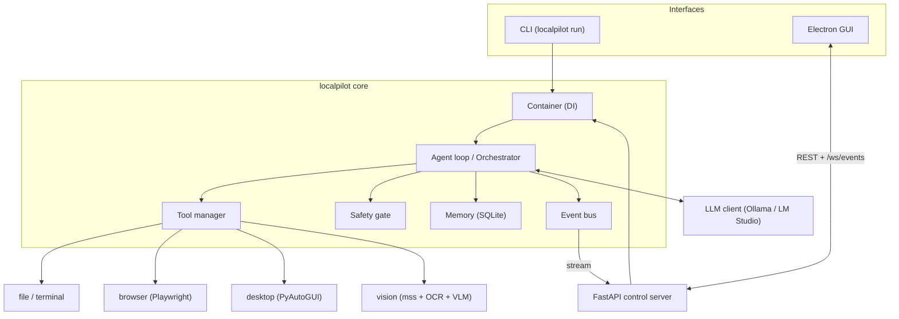

# LocalPilot

**LocalPilot** is an autonomous desktop agent that runs entirely on your own
machine. It reasons with a local, OpenAI-compatible LLM (via
[Ollama](https://ollama.com/) or [LM Studio](https://lmstudio.ai/)) and acts on
the world through tools: the file system, the terminal, a browser, the desktop
(mouse/keyboard/windows) and screen vision (screenshots + OCR + a vision model).
Nothing leaves your computer.

It ships as a **CLI**, an **HTTP/WebSocket control server**, and an **Electron
desktop GUI**.

> Status: **Phases 0-10 complete** - from the configuration scaffold through the
> autonomous agent to the desktop GUI and final documentation.

## Features

- **Local-first**: any OpenAI-compatible `/v1` backend (Ollama, LM Studio). No
  cloud, no API keys required.
- **Autonomous agent loop**: Observe -> Think -> Plan -> Act -> Verify -> Learn,
  with a defensive tool-call parser and a one-shot self-repair on bad output.
- **Tools**: `file_read/write/list`, `dir_create`, `run_command`, `run_python`,
  browser (`browser_open/goto/get_text/click/type/extract_links/search`),
  desktop (`desktop_move/click/double_click/scroll/type/press/activate_window`)
  and vision (`vision_screenshot/describe/ocr/find`).
- **Safety gate** with three modes (safe / balanced / autonomous), confirmation
  prompts and always-on guardrails (command blocklist, workdir write
  restriction, timeouts, PyAutoGUI fail-safe).
- **Memory**: SQLite long-term store (tasks, steps, errors, preferences,
  strategies), bounded short-term working memory, optional `sqlite-vec` vector
  memory.
- **Optional multi-agent** orchestration (planner / executor / debug / research).
- **Control server** (FastAPI): REST + a `/ws/events` WebSocket stream.
- **Desktop GUI** (Electron + React + Vite): live dashboard, confirmations,
  memory browser.

## Architecture



```text
CLI ──┐                         ┌── file / terminal
      ├─► Container ─► Agent ───►│   browser (Playwright)
GUI ─►Server ─┘        │  │  │   ├── desktop (PyAutoGUI)
   (REST + WS)         │  │  │   └── vision (mss + OCR + VLM)
                       │  │  └─► Memory (SQLite)
                       │  └────► Safety gate (safe/balanced/autonomous)
                       └───────► LLM client ◄─► Ollama / LM Studio
```

See [`docs/ARCHITECTURE.md`](docs/ARCHITECTURE.md) for the full design (agent
loop, tool-call contract, data model, safety modes, multi-agent, control server,
GUI, and how to add your own tool).

## Requirements

- **Windows 11** for desktop/vision automation (the rest runs on Linux/macOS for
  development).
- **Python 3.11+**.
- **Node.js 18+** for the GUI.
- A local LLM backend with models pulled, e.g. Ollama:

  ```bash
  ollama pull qwen3:8b          # agent / reasoning model
  ollama pull qwen2.5vl:7b      # vision-language model (for vision_describe)
  ```

  Or LM Studio with its OpenAI server enabled on `http://localhost:1234/v1`.

## Installation (backend)

```bash
python -m venv .venv
# Windows:  .\.venv\Scripts\activate
# Linux/macOS:  source .venv/bin/activate
pip install -e ".[dev]"
playwright install chromium     # browser tools (safe to run even if unused)
cp .env.example .env            # optional: edit overrides
```

Full details incl. Windows-specific notes: [`docs/INSTALL.md`](docs/INSTALL.md).

## Usage - CLI

Run the agent on a goal:

```bash
localpilot run --goal "Lege im Workspace eine Datei notiz.txt mit 'hallo' an und lies sie wieder" --balanced
```

- Safety mode: `--safe` | `--balanced` (default) | `--autonomous`.
- `--multi-agent` uses the orchestrator instead of the single agent.
- Without `--goal`, `run` prompts interactively (or just reports readiness when
  non-interactive).
- `localpilot config` prints the merged configuration; `--config my.yaml` merges
  a custom file over the defaults.

Start the control server (REST + WebSocket):

```bash
localpilot serve   # http://127.0.0.1:8765 ; ws://127.0.0.1:8765/ws/events
```

## Usage - GUI

```bash
cd gui
npm install
npm run dev        # Vite + Electron; Electron starts the backend itself
```

To run the backend separately (e.g. to watch its logs):

```bash
localpilot serve
cd gui && LOCALPILOT_EXTERNAL_BACKEND=1 npm run dev
```

`npm run build` bundles the renderer and `npm start` runs Electron against it.
See [`gui/README.md`](gui/README.md). On Windows, `scripts/dev_run.ps1` starts
both for you.

## Configuration

Layered, lowest precedence first: `config/default.yaml` -> a `--config` YAML file
-> `.env` / environment (`LOCALPILOT_` prefix, `__` for nesting, e.g.
`LOCALPILOT_LLM__MODEL=qwen3:14b`). Ready-made model/vision profiles live in
[`config/models.example.yaml`](config/models.example.yaml); all environment
variables are documented in [`.env.example`](.env.example).

## Safety

The agent only affects the world through tools, and every tool call passes the
**safety gate**:

- **safe** - every action requires confirmation.
- **balanced** (default) - read-only / browser / vision actions run
  automatically; writes, terminal and desktop actions require confirmation.
- **autonomous** - **no per-action confirmation**. The agent will write files,
  run shell commands, control the mouse/keyboard and drive the browser on its
  own.

> ⚠️ **`--autonomous` lets the model act without asking.** Run it only with goals
> and models you trust, ideally with `safety.restrict_writes_to_workdir: true`
> (the default) so writes stay inside the workspace. Static guardrails always
> apply in every mode: a **command blocklist**, **per-tool timeouts**, the
> **workdir write restriction**, and PyAutoGUI's **fail-safe** (slam the mouse
> into a screen corner to abort). Blocklisted shell commands and out-of-workdir
> writes are hard-denied even in autonomous mode.

## Known limitations

LocalPilot is honest about what local, open models can and cannot do today:

- **Tool-calling reliability** depends on the model. Smaller local models
  sometimes emit malformed JSON; the parser strips code fences, matches braces
  defensively and asks for one repair, but a weak model can still fail a step.
  Prefer capable instruct/reasoning models (e.g. Qwen3, DeepSeek-R1).
- **Vision is approximate.** OCR (`rapidocr-onnxruntime`) is solid for clear
  text but struggles with small/stylised fonts; element finding is
  **text/heuristic-based**, not pixel-accurate UI segmentation, so icon-only
  controls without labels cannot be located.
- **Desktop automation** needs an interactive session, is affected by display
  scaling, and cannot control more-privileged windows than LocalPilot itself.
- **Browser** features require `playwright install chromium`; without it the
  browser tools and tests are skipped.
- **No sandbox.** Tools run with your user's privileges. The safety modes and
  guardrails reduce risk but do not isolate execution - review autonomous goals.

## Project layout

```
src/localpilot/      Python package: config, llm, tools, browser, desktop,
                     vision, memory, agent, multiagent, server, container, CLI
config/              default.yaml + example model profiles
docs/                ARCHITECTURE, INSTALL, CUSTOM_TOOLS
gui/                 Electron + React + Vite desktop app
scripts/             helper scripts (dev_run.ps1 / dev_run.sh)
tests/               pytest suite
```

## Development

```bash
pytest          # test suite
ruff check .    # lint (line length 100)
mypy            # strict type-check of src/localpilot
cd gui && npm test   # GUI unit tests (Vitest)
```

## License

MIT - see [`LICENSE`](LICENSE).
