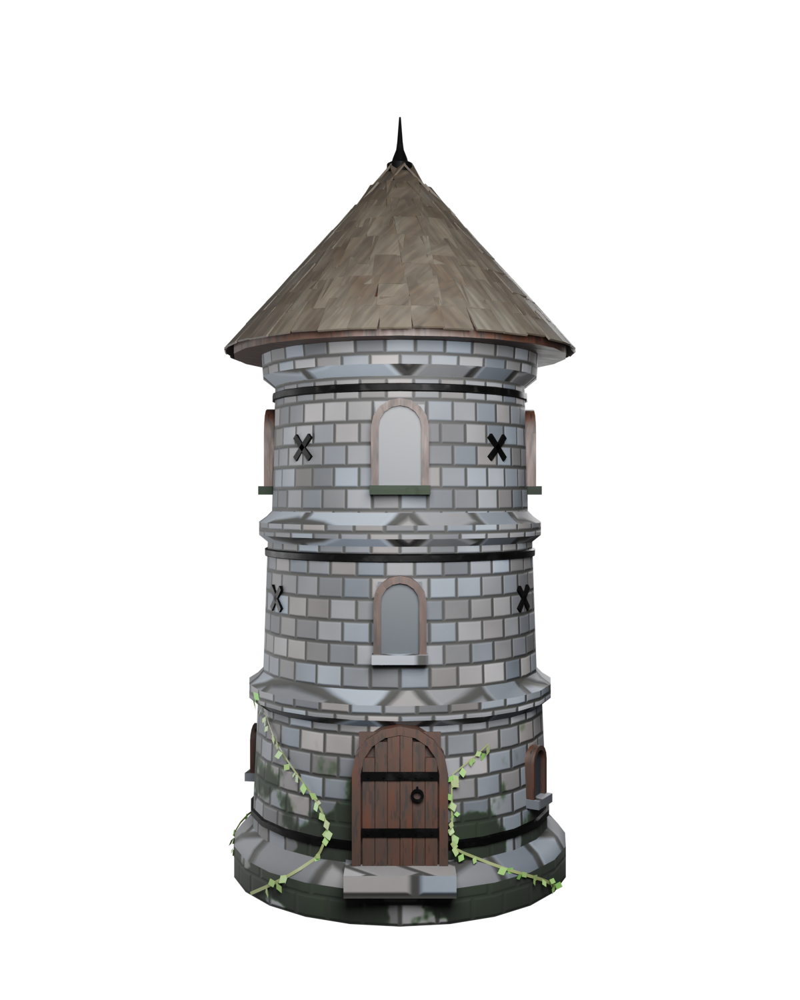
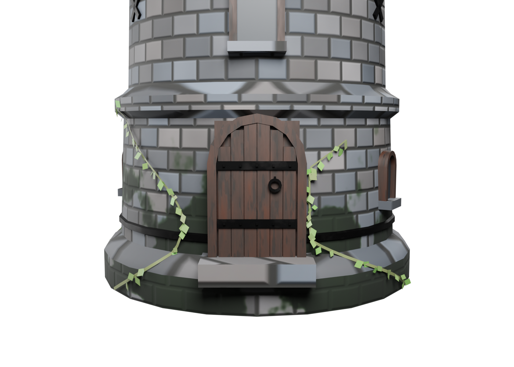
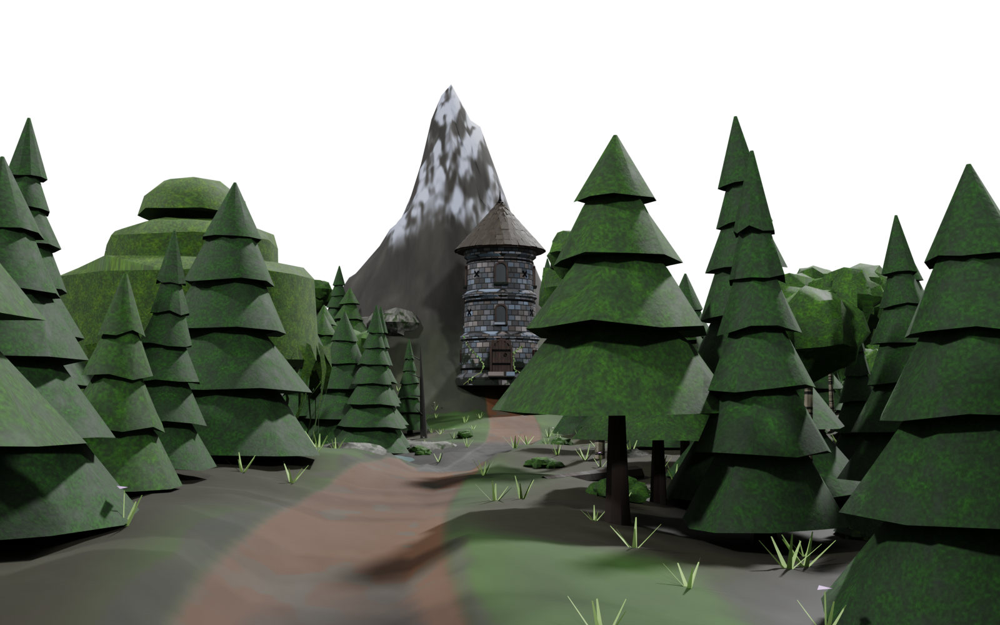
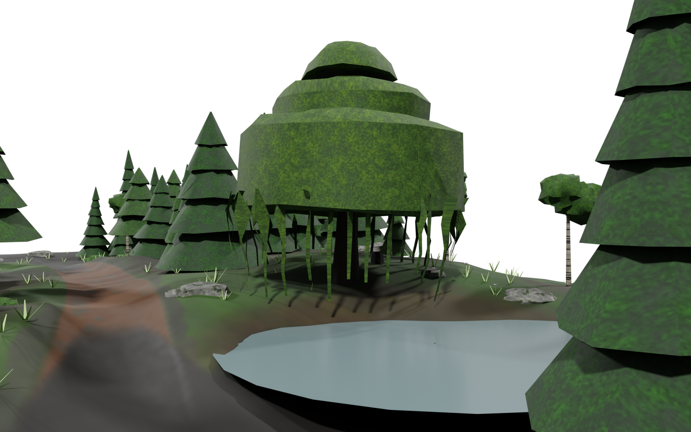
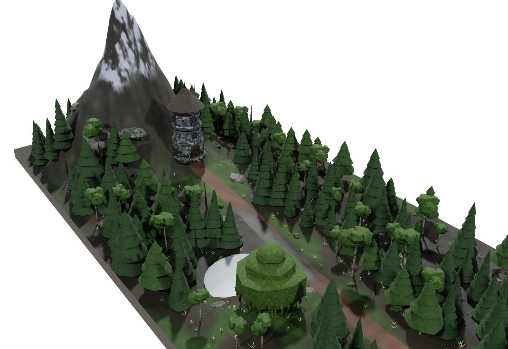

# Nordic Stone Watchtower — procedural Blender asset

A weathered Nordic stone watchtower, generated entirely in Blender by a single
Python script: three stories on a circular, tapered base, wooden shingle roof,
arched windows, iron reinforcements, and moss and ivy creeping up the lower
walls. Stylized-realistic, game-ready, 100 % quad topology.




Also included: a giant Nordic forest diorama in the same style — a winding
path through 230 stylized trees ends at the watchtower, a pond with a large
weeping willow sits beside the path halfway along, and a giant snow-capped
mountain rises directly behind the tower.





## Contents

| Path | Description |
| --- | --- |
| `generate_watchtower.py` | The tower generator. Rebuilds everything (geometry, textures, materials, lights, camera, exports, renders) deterministically from a fixed seed. |
| `generate_forest_scene.py` | The forest diorama generator. Builds the terrain island, path, trees, rocks and bushes, then appends the tower from `exports/watchtower.blend` and places it at the end of the path. |
| `exports/watchtower.blend` | Full tower scene: model, PBR node materials (textures packed), neutral three-point studio lighting, hero + detail cameras, Cycles render settings, transparent film. |
| `exports/watchtower.glb` | Game-ready glTF binary: 8 meshes, 6 materials, 12 embedded PBR maps. No lights/cameras — isolated object. |
| `exports/forest_watchtower.blend` | Forest diorama scene with the tower, neutral sun-based studio lighting, path + aerial cameras. |
| `exports/forest_watchtower.glb` | Forest + tower as glTF binary: ~700 nodes instancing 29 unique meshes, 20 materials, 37 embedded maps (~10 MB). |
| `textures/*.png` | Generated PBR maps: baseColor (sRGB), ORM (occlusion/roughness/metallic, non-color), normal (OpenGL-style, non-color) for stone, wood, shingles, iron, terrain, foliage, bark, rock. |
| `renders/*.png` | Cycles preview renders, transparent background. |

## Regenerating

```sh
# with Blender:
blender --background --python generate_watchtower.py
blender --background --python generate_forest_scene.py   # needs the tower .blend

# or with the pip bpy module (Python 3.11):
pip install bpy numpy
python3 generate_watchtower.py
python3 generate_forest_scene.py
```

Set `WT_SKIP_RENDER=1` to skip the preview renders.

## Asset details

- **Topology:** 3 039 faces, **100 % quads** (0 tris, 0 ngons); ~6 100
  triangles when triangulated — comfortably game-ready. Smooth shading with
  angle-based sharp edges.
- **Structure:** spun-profile stone shell (24 segments) with plinth, two
  string courses and a corbelled top; every part (frames, planks, shingles,
  bands, finial, ivy) is built from quad-only primitives — no booleans.
- **Openings:** the wall shell is uncut; arched frames extrude into the wall
  and recessed panes/planks sit just in front of it, referenced to the wall's
  maximum radius over each opening so nothing pokes through.
- **Roof:** ~180 individually placed and jittered wooden shingles over a
  closed underlayment cone, iron finial spike.
- **Iron reinforcements:** three forged bands around the body, X-shaped wall
  anchors, door straps with studs, ring handle, finial.
- **Moss & ivy:** moss is painted into the stone texture's lower band (the
  tower's cylindrical UVs map v to height, so it lands on the lower walls);
  four ivy vines with leaf cards are real geometry with vertex-color
  variation.
- **Materials:** metal/roughness PBR. Stone, wood, shingles and iron use
  procedurally generated (NumPy) texture maps — masonry courses with bevel
  normals, wood grain, weathered shakes, rusty iron — wired
  baseColor + ORM + normal so the glTF exporter emits standard
  `metallicRoughnessTexture` / `normalTexture` slots. Glass and ivy use
  factor-based PBR (ivy adds `COLOR_0` vertex colors).
- **Scene:** neutral white three-point studio lighting (key/fill/rim area
  lights), transparent background, no ground plane, camera framing the full
  model. Renders with Cycles CPU + OpenImageDenoise.

## Forest diorama details

- **Terrain:** 110 m x 46 m displaced quad grid with a skirt and capped
  bottom (diorama slab). Height, path, pond, mountain, textures and object
  placement all derive from one shared heightfield; the winding dirt path
  is painted into the terrain texture and flattened into the height data,
  and the forest floor darkens to needle litter under the tree canopies (a
  density map splatted from the actual tree placements).
- **The giant mountain:** a ~28 m ridged, craggy peak rises straight behind
  the tower knoll — bare rock above the treeline, noisy snow cap on the
  upper reaches, oversized boulders strewn on its slopes, trees kept below
  6 m elevation.
- **Vegetation:** 7 quad-only tree archetypes — three spruces, two pines
  (lathed trunks + drooping, jittered foliage skirts), white-barked birches
  with leaf-cluster blobs, and dead snags — instanced 230 times with random
  scale, rotation and lean; plus bushes, mossy rocks, fallen logs, stumps,
  500 grass tufts and small flowers. ~950 instances share 29 unique meshes,
  100 % quads.
- **The weeping willow ("die Weide"):** a giant willow with rounded,
  drooping canopy domes and 36 hanging leaf strands stands on the shore of
  a pond carved into the heightfield beside the path, with a flat lathed
  water disc.
- **The tower at the end:** appended from `exports/watchtower.blend` onto a
  knoll at the path's end, door and ivy turned toward the approach.
- **Lighting:** neutral white key/fill/rim sun rig, transparent background —
  the same studio look as the tower asset. Three cameras: path view, pond
  view, aerial.
