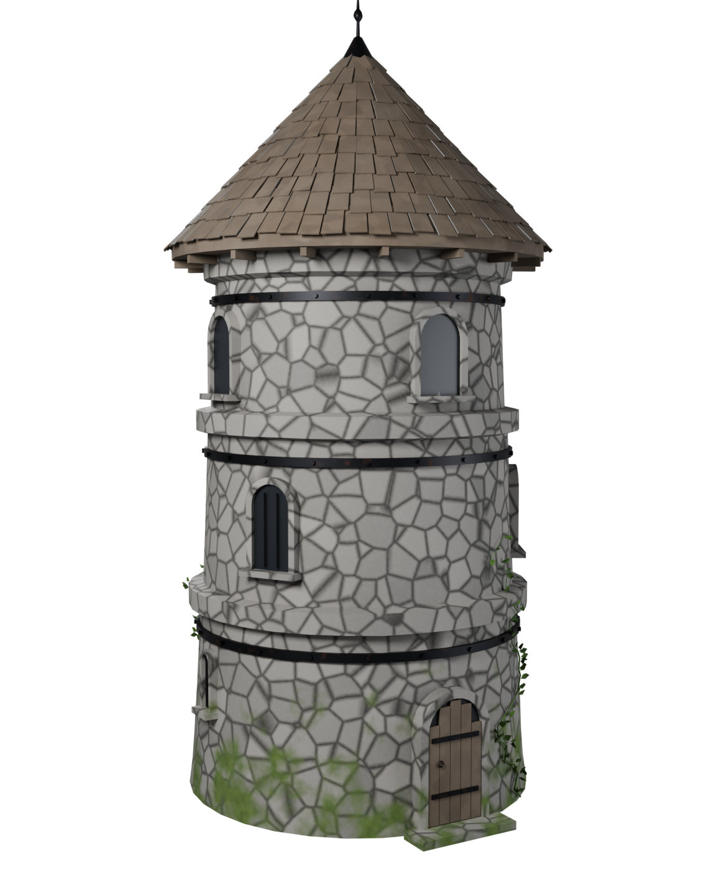

# Nordic Watchtower — procedural Blender asset

A weathered Nordic stone watchtower: three stories on a circular base,
wooden shingle roof, arched windows, iron reinforcements, and moss + ivy
on the lower walls. Stylized-realistic, PBR-textured, game-ready, built
entirely by one Blender Python script — no external assets.



## Contents

| Path | Description |
| --- | --- |
| `generate_watchtower.py` | The generator. Builds geometry, procedural materials, bakes PBR textures, exports, renders. |
| `export/nordic_watchtower.glb` | Game-ready GLB (single mesh, 5 baked PBR materials, embedded textures). |
| `blend/nordic_watchtower.blend` | Blender scene with the baked model, studio lighting and cameras (textures packed). |
| `textures/` | Baked texture sets (BaseColor / Roughness / Normal per material). |
| `renders/` | Cycles studio previews: transparent background, no ground plane. |

## Asset specs

- **Single isolated object** `NordicWatchtower`, origin at the base center,
  real-world scale (~7 m diameter, ~15.4 m to the finial tip). No background,
  no ground plane.
- **Topology**: predominantly quads (~85 % of faces; triangles only in
  hidden cap fans and small ngons in the dark window recesses),
  ~12 k triangles after export triangulation — suitable as a game prop.
- **Materials** (metal/rough PBR, baked): `M_Stone_Baked` (2048),
  `M_Wood_Baked` (2048), `M_Iron_Baked` (1024, metallic = 1),
  `M_Leaf_Baked` (512), `M_Dark_Baked` (128). BaseColor is sRGB;
  Roughness and Normal (tangent-space, OpenGL Y+) are linear.
- **Shading**: smooth with 40° auto-smooth angle; normals and UVs exported.

## Construction notes

- The stone shell is a lathe over a (z, radius) profile with string courses
  and a corbelled top; vertices get small noise jitter for the hand-built,
  weathered silhouette.
- Windows and the door are boolean-free: a raised stone arch frame, reveal,
  and a dark recessed panel sitting proud of the wall, so the shell keeps
  clean quad loops.
- The roof is a wooden deck cone with 361 individually placed, jittered
  shingle boxes, rafter tails under the eave, and an iron finial spike.
- Iron reinforcement: three riveted tension bands, window bars, hinge
  straps, studs, and a door ring.
- Moss is a height + noise threshold blend in the stone shader (baked into
  the textures); ivy is three random-walk vines with folded-quad leaves.

## Regenerating

Requires the official `bpy` wheel (Blender 5.x) or a full Blender install
with a working Cycles bake path:

```bash
pip install bpy numpy
python3 watchtower/generate_watchtower.py -- [--fast] [--no-renders] [--out DIR]
```

`--fast` builds a low-res draft in ~15 s for iteration. Note that some
distro Blender packages (e.g. Ubuntu's) ship a Cycles that silently bakes
black textures and lacks the OIDN denoiser; the script falls back to
supersampled renders there, but baking needs an official build.
